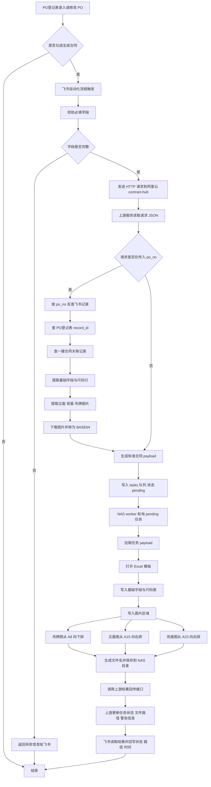
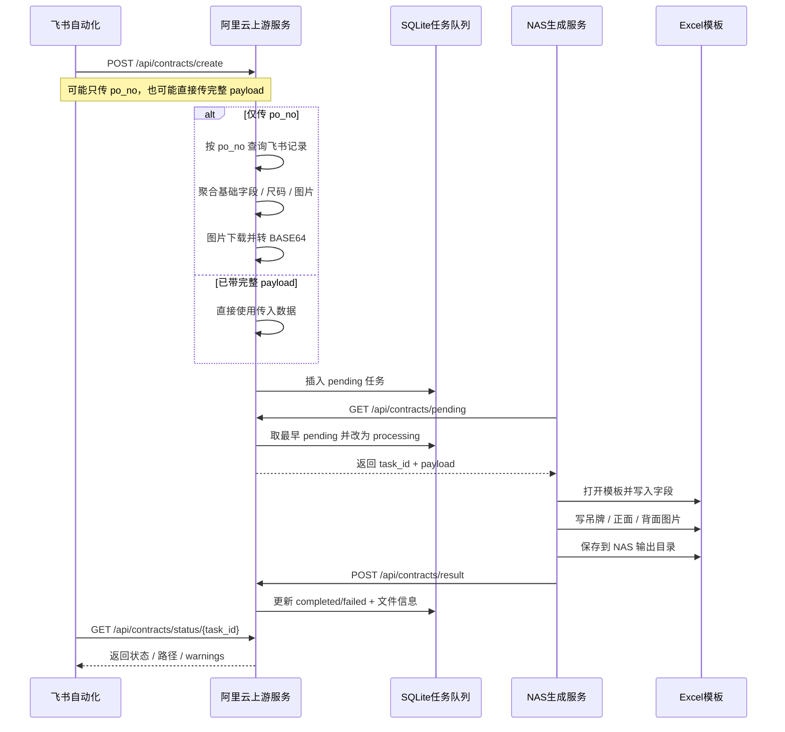
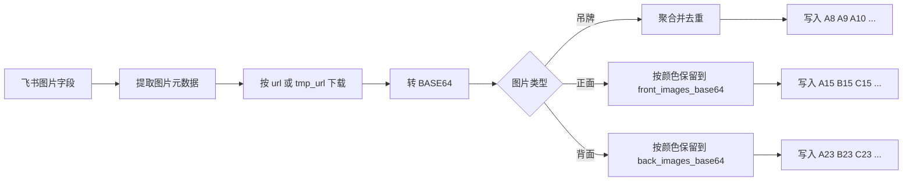

# PO 合同自动生成当前工作流

这份流程图基于目前已经跑通的真实链路整理，覆盖飞书触发、阿里云上游服务、NAS 模板生成、结果回写这 4 段。

## 总览

## 上下游时序图

## 图片处理逻辑

## 当前落地规则

- 上游服务运行在阿里云，采用 `systemd` 管理，重启命令是 `systemctl restart contract-hub`
- 上游图片逻辑已经改为 `BASE64` 传输，不再依赖 NAS 直接访问飞书图片地址
- 吊牌图支持跨颜色聚合并去重，适合“多数统一吊牌、少数多吊牌”的场景
- NAS 服务负责模板渲染和文件落盘，当前已支持吊牌、正面、背面 3 类图片位
- 结果会回写任务状态、输出路径、警告信息，便于飞书侧追踪

## 建议的后续扩展

- 把主唛、洗水唛、包装图也纳入同一套“聚合 + 去重 + 定位写入”机制
- 给图片区域增加“超出自动换行”规则，避免未来图片数量增加后人工调整模板
- 增加异常分支图：飞书字段缺失、图片下载失败、NAS 保存失败、结果回写失败
- 增加运维发布流程图：本地 `scp` 上传 → `py_compile` → `systemctl restart` → 健康检查
